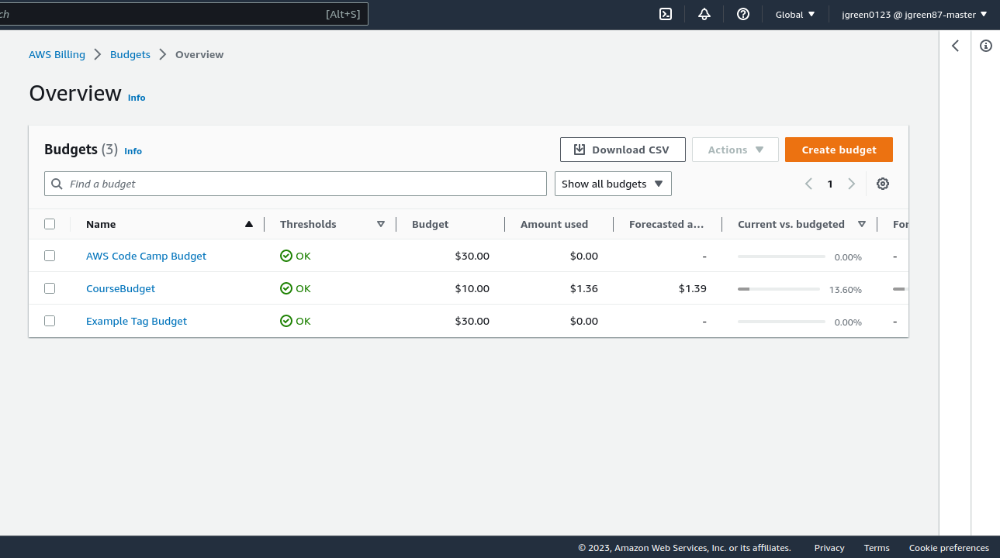

# Week 0 — Billing and Architecture

### Install and Verify AWS CLI
I installed the AWS CLI for Linux by using the following commands to download, unzip and install the package: <br>
``` 
    curl "https://awscli.amazonaws.com/awscli-exe-linux-x86_64.zip" -o "awscliv2.zip"
    unzip awscliv2.zip
    sudo ./aws/install
```
I followed along using the AWS CLI install documentation: <br>
[AWS CLI Install Documentation Page](https://docs.aws.amazon.com/cli/latest/userguide/getting-started-install.html)


### Create a Budget
I created two budgets trying out both the AWS console method and the AWS CLI method and I must say I like the AWS CLI method better. I set my budget to $30. <br>
 


### Recreate Logical Architectural Deisgn


[Lucid Charts Logical Diagram Link](https://lucid.app/lucidchart/2ebace42-8400-44c2-b0dd-f39071d386e9/edit?viewport_loc=-472%2C-96%2C2511%2C1081%2C0_0&invitationId=inv_a6ddf182-cfc9-42cf-8c0a-4b527758b5a5)

